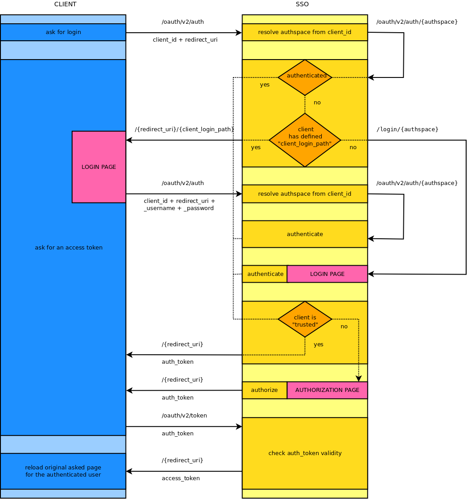

DaOAuthServerBundle
===================

This bundle for Symfony2 (built upon [FOSOAuthServerBundle](https://github.com/FriendsOfSymfony/FOSOAuthServerBundle)) allows to use the oauth mechanism in different "authspaces". It gives the possibility to build a unique SSO oauth server acting as if you had several ones.

Documentation
-------------

Here is a diagram of the multi authspaces oauth flow:

Learn how to use the bundle with the [documentation](Resources/doc/index.md).

Suggestions
-----------

Want to be client of your oauth SSO?
Take a look at the [DaOAuthClientBundle](https://github.com/Gnuckorg/DaOAuthClientBundle)!

Want to communicate from API to API or from Client to API?
Take a look at the [DaApiServerBundle](https://github.com/Gnuckorg/DaApiServerBundle)!
